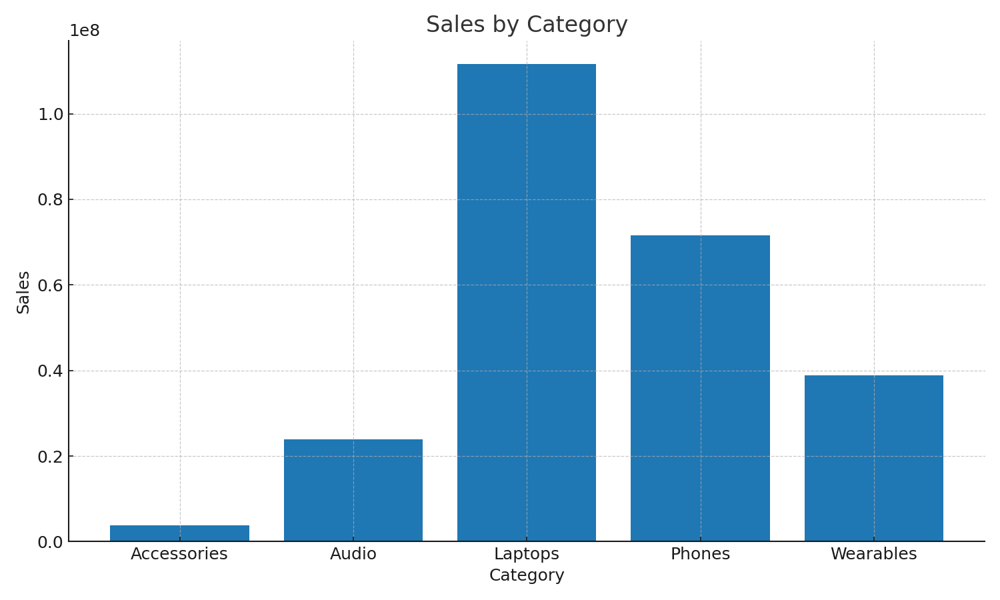
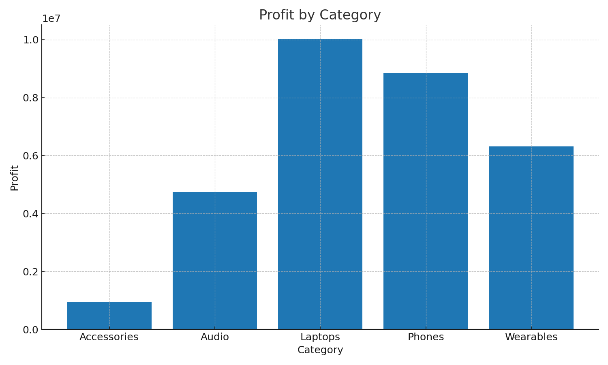
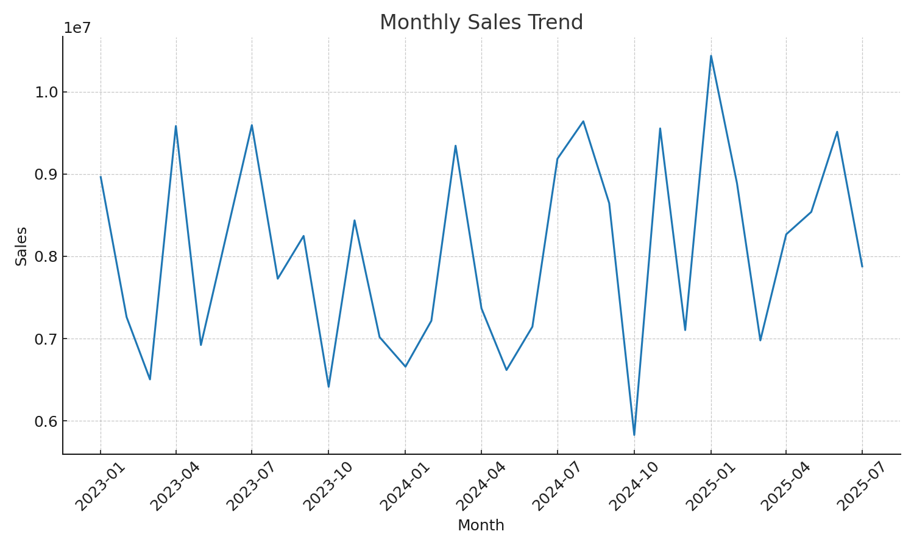
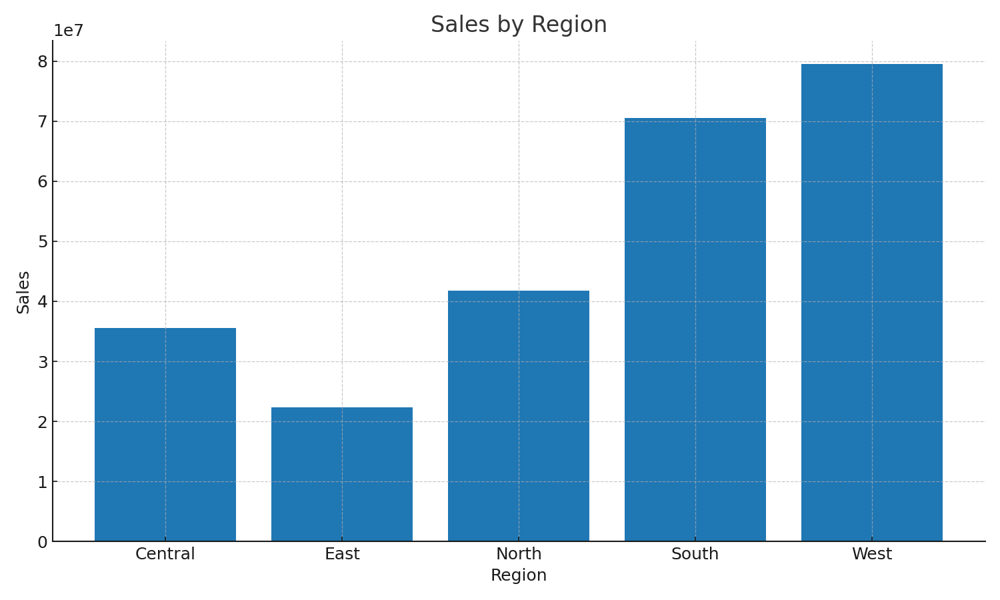
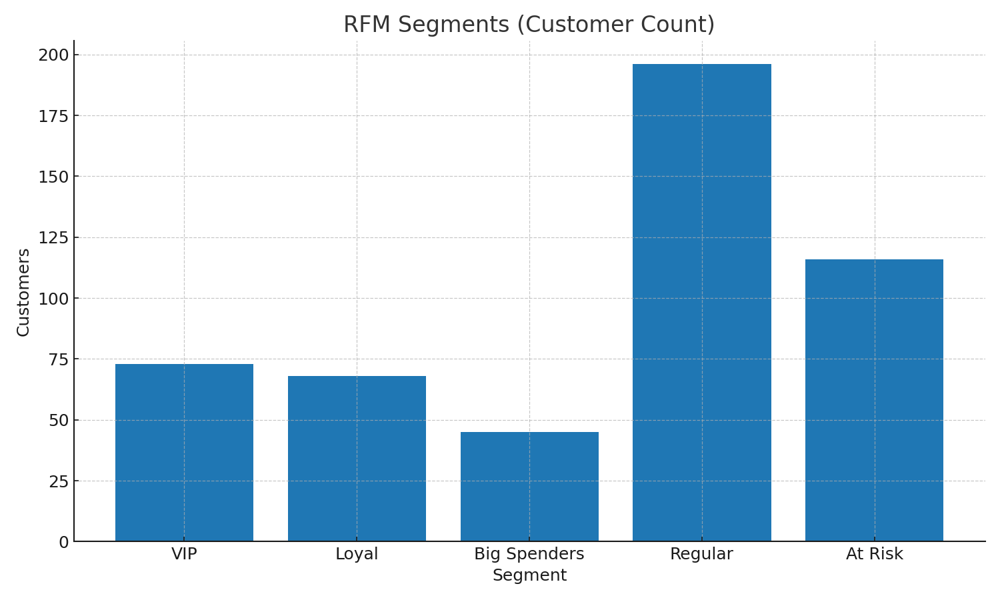
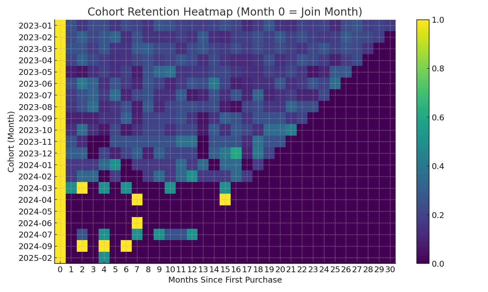

# 🛍️ Retail Sales Analysis (Python EDA)

End-to-end **data analytics project** using Python, pandas, and Plotly. We analyze retail sales to find top categories, regional performance, customer value segments (RFM), and retention trends (cohort analysis).

## 📦 Repository Contents
- `retail_sales_analysis.ipynb` — main notebook with visuals & insights
- `retail_orders.csv`, `retail_customers.csv`, `retail_products.csv` — sample datasets
- `retail_images/` — static charts for quick preview

## 🎯 Objectives
- Which categories and regions drive **sales** and **profit**?
- What are our **monthly trends**?
- Who are our **VIP / Loyal / At Risk** customers (RFM)?
- How well do we **retain** customers month over month (cohort)?

## 🖼️ Preview Charts

## 🧰 Stack
- Python (pandas, numpy)
- Plotly (interactive in notebook)
- Matplotlib (static PNGs for README)
- Jupyter Notebook

## 📌 Insights (Highlights)
- **Laptops** drive the most revenue; **Accessories** offer stable margins
- **West** is the strongest region
- **Big Spenders** contribute most value; **Regulars** are largest by count
- **Retention** drops slowly — customers continue buying in early months

## 💡 Recommendations
- Retain high-value customers with **VIP offers**
- Upsell **Regulars** into higher-ticket categories
- Win-back **At Risk** customers (inactive 3+ months)
- Tune **discounts** where profit dips

---

